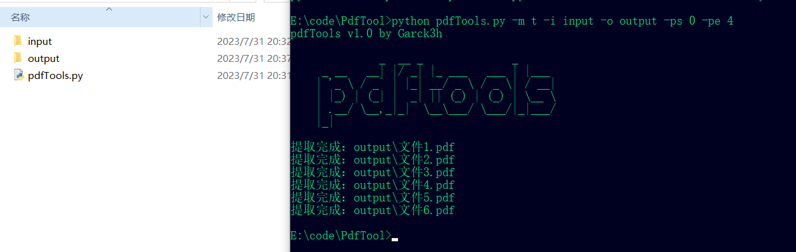
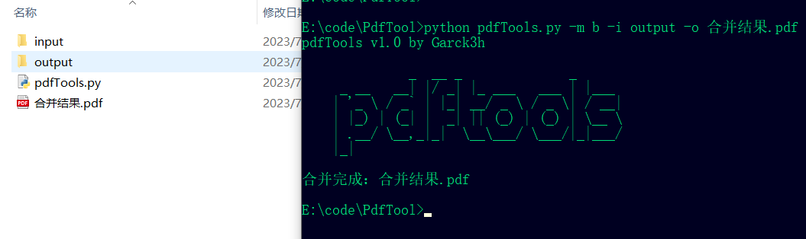

# pdfTools
## 功能：
1.可以批量提取PDF文件中指定的页的范围

2.可以合并多个PDF文件为一个

## 命令详解：
```java
  -h, --help            显示帮助
  -m MODE, --mode MODE  选择功能：t - 批量提取前四页，b - 合并指定文件夹的PDF
  -i INPUT, --input INPUT        输入文件夹路径
  -o OUTPUT, --output OUTPUT     输出文件夹/文件路径
  -ps START_PAGE, --start_page START_PAGE     提取范围的起始页（仅适用于提取功能）
  -pe END_PAGE, --end_page END_PAGE   提取范围的结束页（仅适用于提取功能）
```


## 用法1
批量提取指定文件夹input文件夹中的所有PDF文件的0-4页

```java
python pdfTools.py -m t -i input -o output -ps 0 -pe 4
-m 指定了t选择了批量提取模式
-i 是存放PDF文件的文件夹
-o 是输出的文件夹
-ps 是选择起始页
-pe 是选择结束页
```



## 用法2
指定文件夹的所有PDF文件合并

```java
python pdfTools.py -m b -i output -o 合并结果.pdf
-m b 选择合并模式
-i 指定需要合并的PDF的文件夹
-o 输出的文件的名称

```


